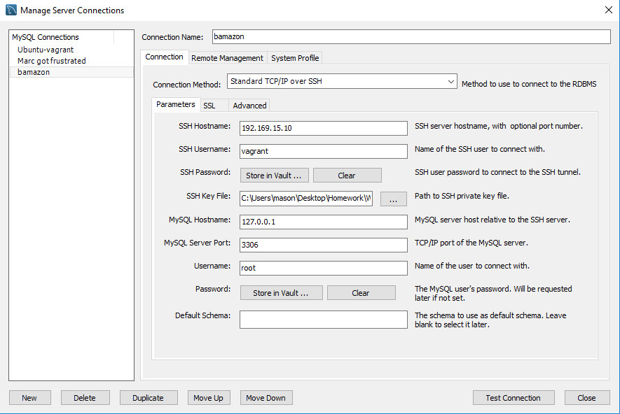

# bamazon

## Contents
- [Requirements](#requirements)
- [Description](#description)
- [Tools Used](#tools-used)
- [How to Use](#how-to-use)
  - [Setup](#setup)
    - [Using the VM Provided](#using-the-vm-provided)
    - [Not Using the VM Provided](#not-using-the-vm-provided)
## Requirements
- [Nodejs](https://nodejs.org/en/download/ "Install Node")
- [MySQL](https://dev.mysql.com/downloads/installer/ "Install MySQL")
- [MySQL Workbench](https://dev.mysql.com/downloads/workbench/ "Install MySQL Workbench")

## Description
This application is designed to interact with a mysql database using javascript through the command line.

## Tools used
- Javascript
- NPM
  - [cli-table](https://www.npmjs.com/package/cli-table "Cli-Table's NPM page")
  - [inquirer](https://www.npmjs.com/package/inquirer "Inquirer's NPM page")
  - [mysql](https://www.npmjs.com/package/mysql "MySQL's NPM page")
- Node
- MySQL
- MySQL Workbench

## How to use
### Setup
#### Using the VM Provided
1. If you are new to using VM's check the Ubuntu Vagrant Shell's README found [here](https://github.com/switch120/ubuntu-vagrant-shell)
2. Clone this repo onto your computer
3. Navigate to the VM in your CLI and run `vagrant up`
4. Run `vagrant ssh`
5. Establish a connection to MySQL by running `mysql -u root -p` it will then prompt you to enter your password. It will be root by default (can be changed in provisioner)
6. Open MySQL Workbench and create a connection through there

7. Run the [schema.sql](./code/database/schema.sql) in the query window
8. Run the [seeds.sql](./code/database/seeds.sql) in the query window
9. Navigate to the code folder on your VM and run `npm install`
10. Run `node bamazonCustomer.js`

#### Not Using the VM Provided
1. Clone this repo onto your computer
2. Move the contents of the code folder to your preferred VM
3. Install the dependencies
4. Set up connection to MySQL
5. Run the Schema and Seeds
6. Run `node bamazonCustomer.js`

 - Establish a connection to MySQL/MySQL Workbench

 - Run the schema.sql file
 - Run the seeds.sql file

### Options:
All of these commands should be run in the CLI, CTRL + C can exit if needed

- `node bamazonCustomer.js`
  - This is the main way to interact with the app. This will present you with a list of options for searching
- `node bamazonCustomer.js list-all`
  - This will list all of the items in the database
- `node bamazonCustomer.js buy-item`
  - This will let you buy an item by ID